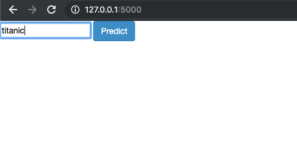
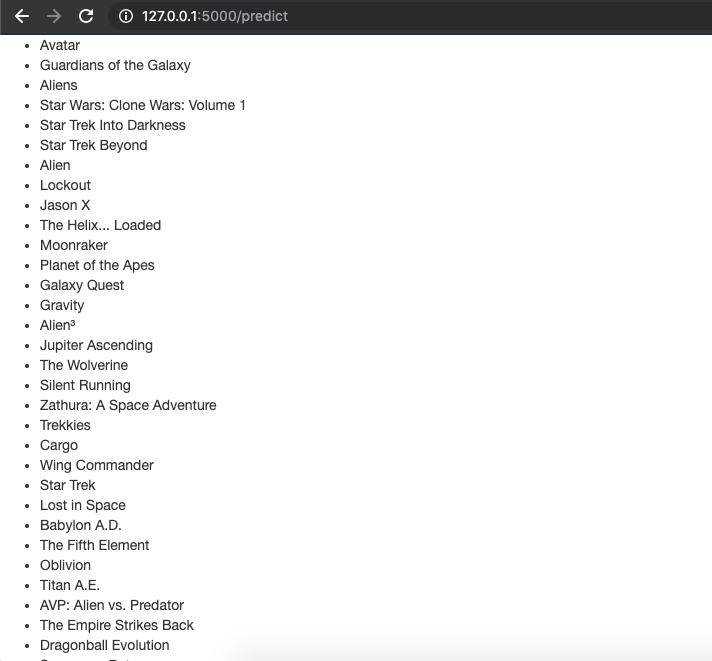

# movie_recommendation

## Tools used
This project was done using python, flask and scikit learn

## Features:
keywords, cast, genres, director

## Procedure:
All the features are combined and frequency of each word is counted.

These frequencies are used to find out the similarity scores matrix

Based on the given input, the movies closer to the movie in similarity matrix are rendered onto a new page.

This is where the movie name is to be entered

Recommendations similar to the entered movie are shown below

